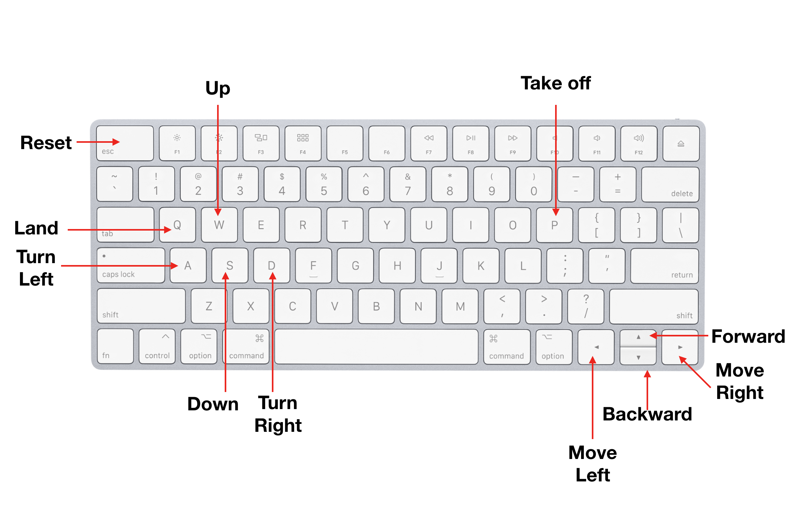

# Tello

This library provides multiple controllers to use easy the DJ Tello drone using Golang.

## Controllers

The following are the supported devices:

- [x] Key board
- [ ] Leap motion device


### Keyboard

You can handle the drone using the default keyboard  configuration. The following is the setup.



#### Example

```go
import (
	"tello/controller"

	"gobot.io/x/gobot"
	tello "gobot.io/x/gobot/platforms/dji/tello"
	"gobot.io/x/gobot/platforms/keyboard"
)

func main() {
	drone := tello.NewDriver("8888")
	keys := keyboard.NewDriver()
	c := controller.NewKeyBoard(drone, keys)

	work := func() {
		c.Run()
	}

	robot := gobot.NewRobot("tello",
		[]gobot.Connection{},
		[]gobot.Device{keys, drone},
		work,
	)

	robot.Start()
}
```
